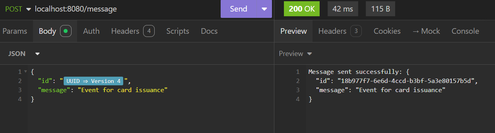
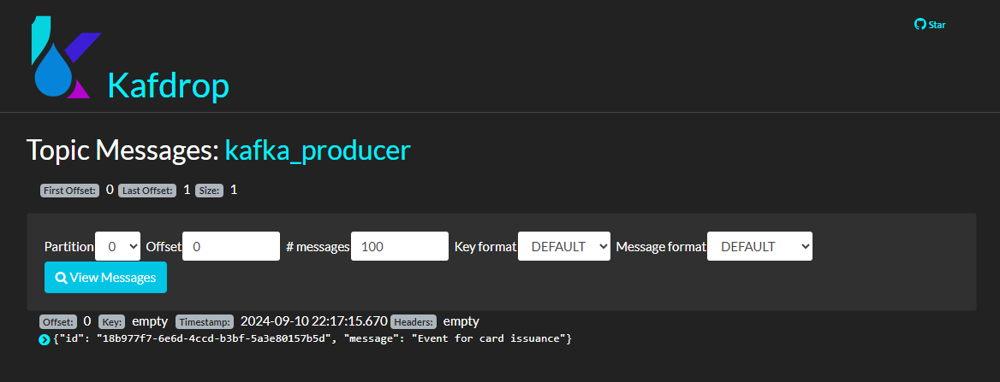
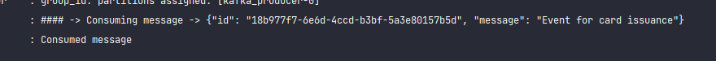

# Kafka Project
## Producer and Consumer with Kafka

Application producer posts message in kafka topic ``kafka_producer`` and consumer application listens to the message and converts it to object

## Run local app
- Clone this repository
- Access Docker file folder
- Run the command ``docker -compose -f kafka-docker-compose.yml up -d``

## Inputs to producer
| Name    | Description   |
|---------|---------------|
| id      | Message ID    |
| message | Message body  |

ex:

{
	"id": "18b977f7-6e6d-4ccd-b3bf-5a3e80157b5d",
	"message": "Event for card issuance"
}
##### Expected Status 200 OK

##### Message is sent to topic kafka_producer

##### Consumer Application Logs Consuming the Message

